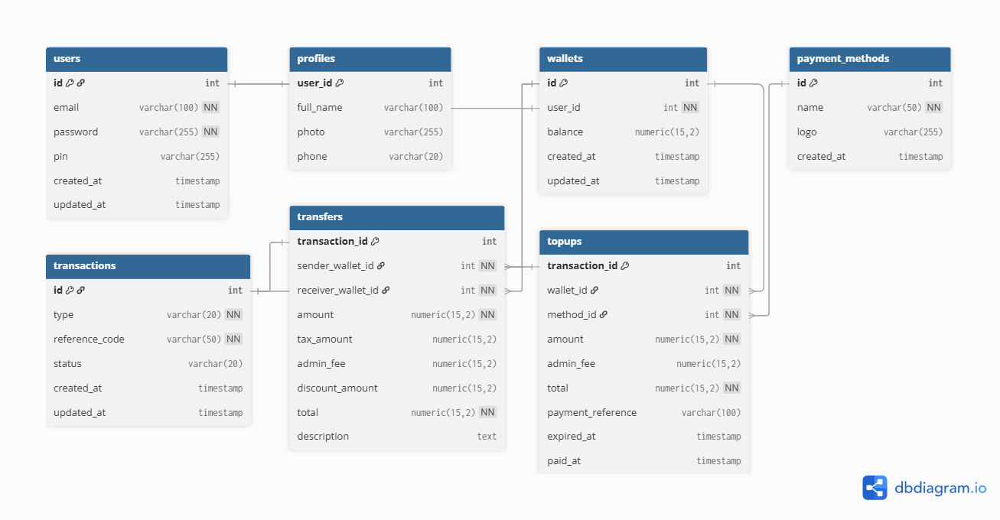

## ERD



```sql
CREATE TABLE users (
    id SERIAL PRIMARY KEY,
    email VARCHAR(100) NOT NULL UNIQUE,
    full_name VARCHAR(100),
    password VARCHAR(255) NOT NULL,
    pin VARCHAR(255),
    photo VARCHAR(255),
    phone VARCHAR(20) UNIQUE,
    balance NUMERIC(15,2) DEFAULT 0,
    created_at TIMESTAMP DEFAULT NOW(),
    updated_at TIMESTAMP
);

CREATE TABLE payment_methods (
    id SERIAL PRIMARY KEY,
    name VARCHAR(50) NOT NULL UNIQUE,
    logo VARCHAR(255) NOT NULL,
    created_at TIMESTAMP
);

CREATE TABLE transactions (
    id SERIAL PRIMARY KEY,

    sender_id INT,
    receiver_id INT,

    type VARCHAR(20) NOT NULL,

    amount NUMERIC(15,2) NOT NULL,
    tax_amount NUMERIC(15,2) DEFAULT 0,
    admin_fee NUMERIC(15,2) DEFAULT 0,
    discount_amount NUMERIC(15,2) DEFAULT 0,

    total NUMERIC(15,2) NOT NULL,

    method_id INT,

    reference_code VARCHAR(50) NOT NULL UNIQUE,

    status VARCHAR(20) DEFAULT 'pending',

    description TEXT,

    created_at TIMESTAMP DEFAULT NOW(),
    updated_at TIMESTAMP,

    CONSTRAINT fk_sender
        FOREIGN KEY (sender_id)
        REFERENCES users(id),

    CONSTRAINT fk_receiver
        FOREIGN KEY (receiver_id)
        REFERENCES users(id),

    CONSTRAINT fk_payment_method
        FOREIGN KEY (method_id)
        REFERENCES payment_methods(id)
);
```
